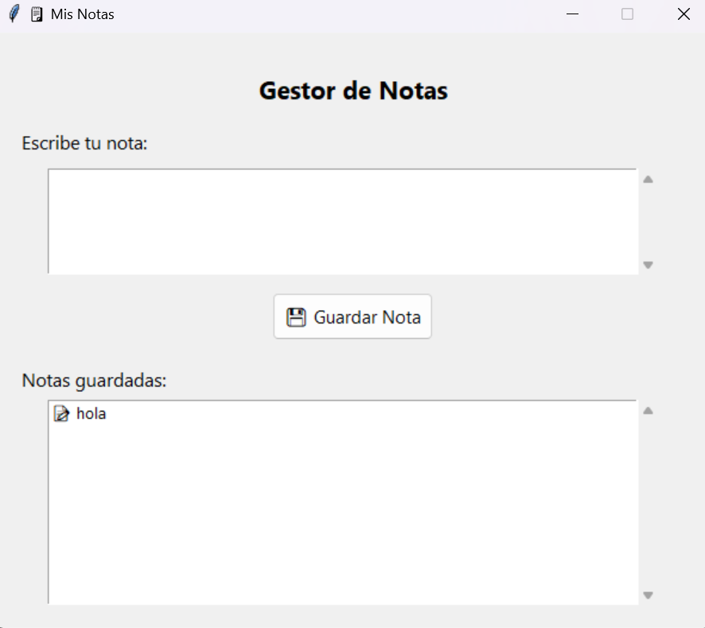

# NotasApp
Gestor de Notas en Python

Este es un prototipo funcional de una aplicación de escritorio simple creada con **Python**, que permite guardar notas o recordatorios localmente en una base de datos **SQLite** y simula el envío de cada nota a un servidor REST.

## ✨ Características

- Interfaz gráfica moderna con `Tkinter` y `ttk`.
- Guardado de notas en una base de datos local (`SQLite`).
- Visualización de todas las notas guardadas en pantalla.
- Simulación de envío de notas a un servidor REST (impresión de JSON en consola).

## 🖼 Captura de Pantalla

 <!-- Puedes añadir una imagen aquí si la tienes -->

## 🚀 Requisitos

- Python 3.7 o superior

No se necesitan dependencias externas adicionales, solo se utilizan módulos estándar.
